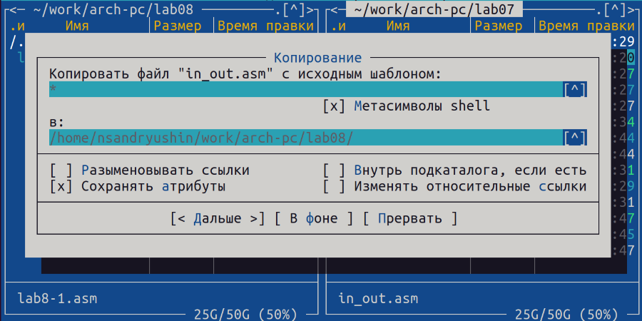
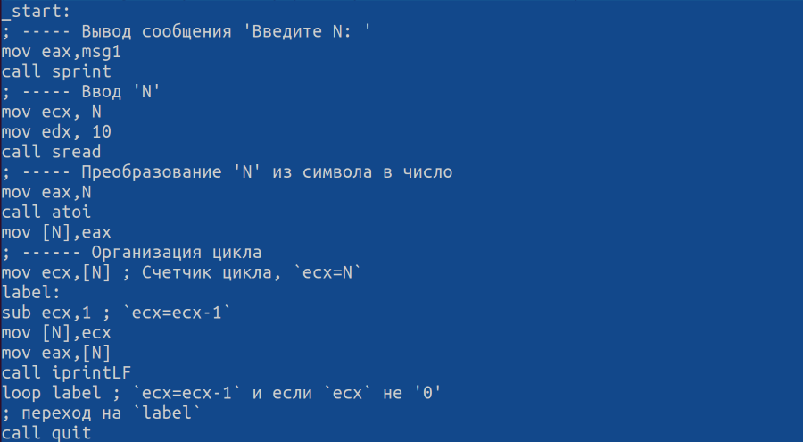
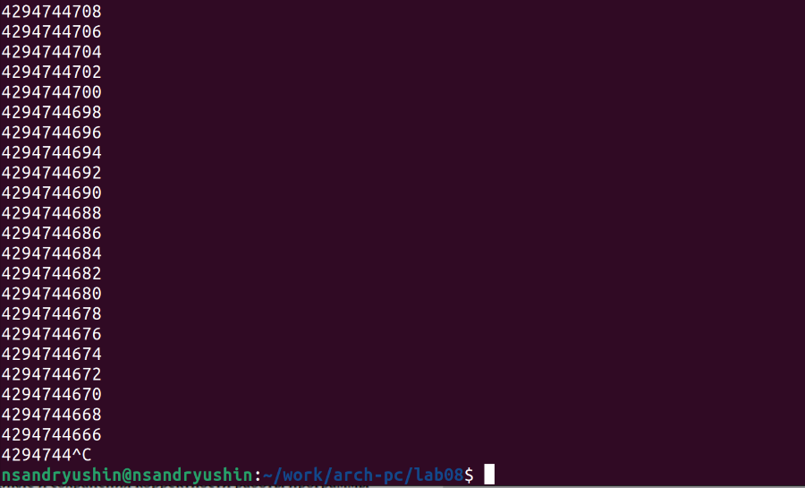
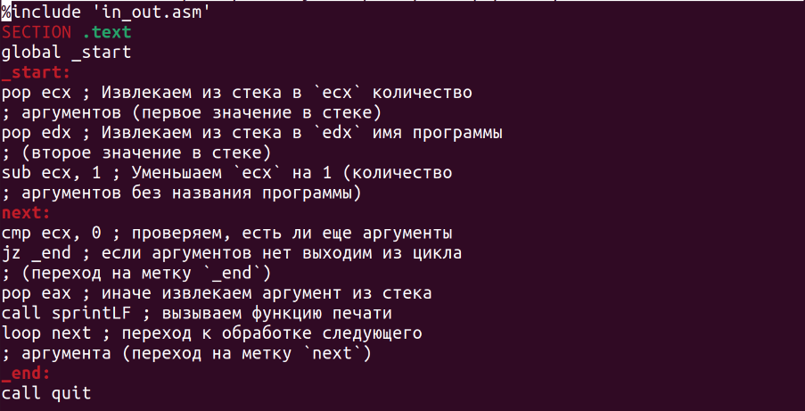
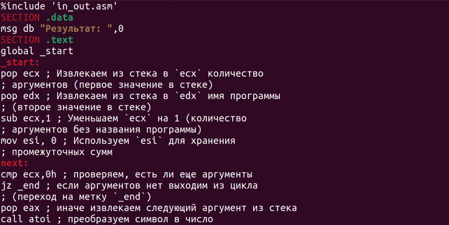
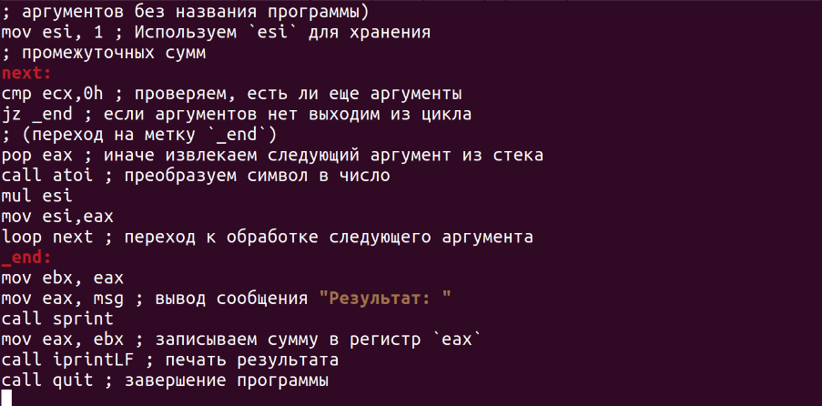
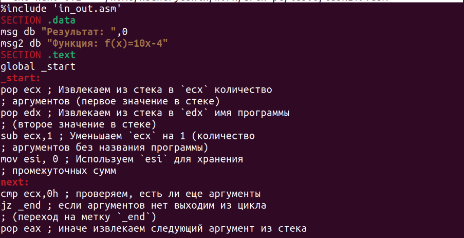
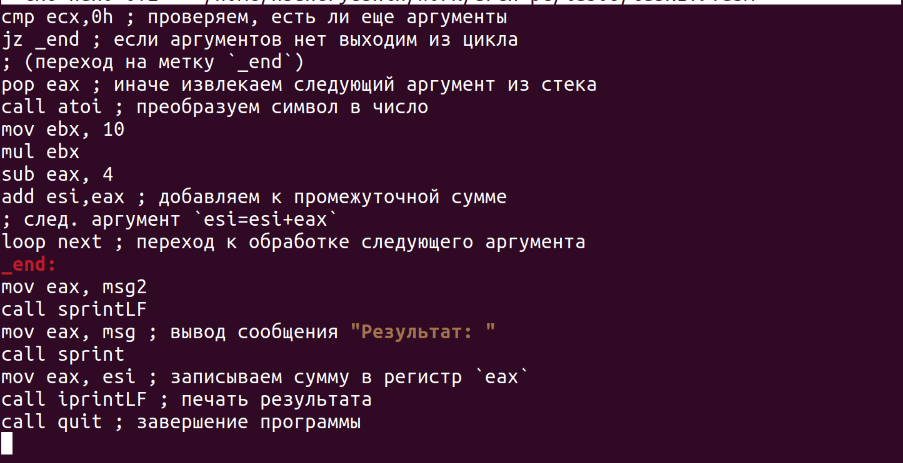

---
## Front matter
title: "Лабораторная работа №8"
subtitle: "Программирование цикла. Обработка аргументов командной строки"
author: "Андрюшин Никита Сергеевич"

## Generic otions
lang: ru-RU
toc-title: "Содержание"

## Bibliography
bibliography: bib/cite.bib
csl: pandoc/csl/gost-r-7-0-5-2008-numeric.csl

## Pdf output format
toc: true # Table of contents
toc-depth: 2
lof: true # List of figures
lot: true # List of tables
fontsize: 12pt
linestretch: 1.5
papersize: a4
documentclass: scrreprt
## I18n polyglossia
polyglossia-lang:
  name: russian
  options:
	- spelling=modern
	- babelshorthands=true
polyglossia-otherlangs:
  name: english
## I18n babel
babel-lang: russian
babel-otherlangs: english
## Fonts
mainfont: PT Serif
romanfont: PT Serif
sansfont: PT Sans
monofont: PT Mono
mainfontoptions: Ligatures=TeX
romanfontoptions: Ligatures=TeX
sansfontoptions: Ligatures=TeX,Scale=MatchLowercase
monofontoptions: Scale=MatchLowercase,Scale=0.9
## Biblatex
biblatex: true
biblio-style: "gost-numeric"
biblatexoptions:
  - parentracker=true
  - backend=biber
  - hyperref=auto
  - language=auto
  - autolang=other*
  - citestyle=gost-numeric
## Pandoc-crossref LaTeX customization
figureTitle: "Рис."
tableTitle: "Таблица"
listingTitle: "Листинг"
lofTitle: "Список иллюстраций"
lotTitle: "Список таблиц"
lolTitle: "Листинги"
## Misc options
indent: true
header-includes:
  - \usepackage{indentfirst}
  - \usepackage{float} # keep figures where there are in the text
  - \floatplacement{figure}{H} # keep figures where there are in the text
---

# Цель работы

Научиться работать с циклами на языке Ассемблера, а также научиться обрабатывать аргументы командной строки

# Выполнение лабораторной работы

Для начала выполнения лабораторной работы создадим рабочую директорию и файл lab8-1.asm (рис. 2.1):

Далее, запустим Midnight commander (рис. 2.2):

Теперь, вставим в ранее созданный файл из листинга 8.1. Он должен запускать цикл и выводить каждую итерацию число, на единицу меньше предыдущего (начинается выводить с числа N) (рис. 2.3):

Чтобы собрать код, нужен файл in_out.asm. скопируем его из директории прошлой лабораторной работы (рис. 2.4):

Теперь соберём программу и посмотрим на результат выполнения (рис. 2.5):

Как видим, она выводит числа он N до единицы включительно. Теперь попробуем изменить код, чтобы в цикле также отнималась единица у регистра ecx (рис. 2.6):

Попробуем собрать программу и запустить её (рис. 2.7):

Введём в качестве N число 5 и посмотрим на результат выполнения (рис. 2.8):

Как видим, цикл выполняется бесконечное количество раз. Это связано с тем, что цикл останавливается в тот момент, когда при проверке ecx равен 0, но он каждое выполнение цикла уменьшается на 2, из-за чего, в случае нечётного числа, никогда не достигнет нуля. Регистр ecx меняет своё значение дважды: стандартно -1 после каждой итерации и -1 в теле цикла из-за команды sub. Если на вход подать чётное число, цикл прогонится N/2 раз, выводя числа от N-1 до 1 (выводит через одно число) (рис. 2.9):

 Таким образом, количество итераций цикла не равно N ни при подаче на вход чётного числа, ни при подаче нечётного.

 Теперь попробуем изменить программу так, чтобы она сохраняла значение регистра ecx в стек (рис. 2.10):

Попробуем собрать и запустить программу (рис. 2.11):

Теперь, программа выводит все числа от N-1 до нуля. Таким образом, число прогонов цикла равно числу N. Создадим второй файл (рис. 2.12):

И вставим в него код из файла листинга 8.2 (рис. 2.13):

Соберём и запустим его, указав некоторые аргументы. Посмотрим на результат (рис. 2.14):

Как видим, он обработал 4 аргумента. Аргументы разделяются пробелом, либо, когда аргумент содержит в себе пробел, обрамляется в кавычки. Создадим третий файл (рис. 2.15):

И вставим в него код из листинга 8.3. Он будет находить сумму всех аргументов (рис. 2.16):

Теперь соберём программу и запустим её (рис. 2.17):

Как видим, программа действительно выводит сумму всех аргументов. Изменим её так, чтобы она находила не сумму, а произведение всех аргументов (рис. 2.18):

Соберём программу и запустим её (рис. 2.19):

Как видим, программа выводит правильный ответ

# Выполнение задания для самостоятельной работы

Для выполнения самостоятельной работы создадим файл в формате .asm (рис. 3.1):

В рамках самостоятельной работы необходимо сделать задание под вариантом 9. Так, необходимо сложить результаты выполнения функции f(x)=10x-4 для всех введённых аргументов (рис. 3.2 и рис. 3.3):

Соберём и запустим программу, вводя различные аргументы (рис. 3.4):

Пересчитав результат вручную, убеждаемся, что программа работает верно

# Выводы

В результате выполнения лабораторной работы были получены навыки работы с циклами и обработкой аргументов из командной строки. Были написаны программы, использующие все вышеописанные аспекты
