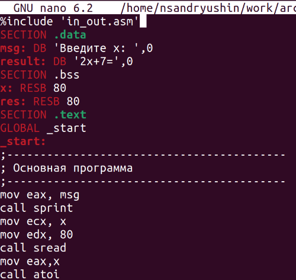
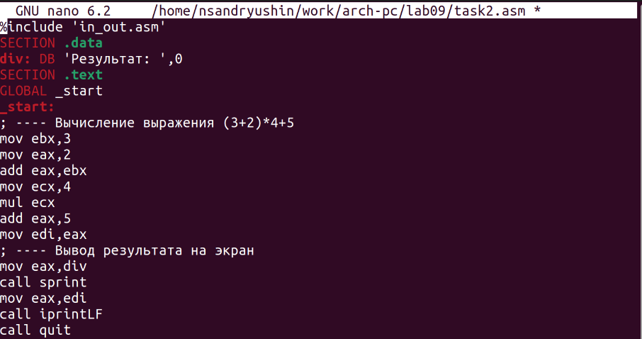

---
## Front matter
title: "Лабораторная работа №9"
subtitle: "Понятие подпрограммы. Отладчик GDB"
author: "Андрюшин Никита Сергеевич"

## Generic otions
lang: ru-RU
toc-title: "Содержание"

## Bibliography
bibliography: bib/cite.bib
csl: pandoc/csl/gost-r-7-0-5-2008-numeric.csl

## Pdf output format
toc: true # Table of contents
toc-depth: 2
lof: true # List of figures
lot: true # List of tables
fontsize: 12pt
linestretch: 1.5
papersize: a4
documentclass: scrreprt
## I18n polyglossia
polyglossia-lang:
  name: russian
  options:
	- spelling=modern
	- babelshorthands=true
polyglossia-otherlangs:
  name: english
## I18n babel
babel-lang: russian
babel-otherlangs: english
## Fonts
mainfont: PT Serif
romanfont: PT Serif
sansfont: PT Sans
monofont: PT Mono
mainfontoptions: Ligatures=TeX
romanfontoptions: Ligatures=TeX
sansfontoptions: Ligatures=TeX,Scale=MatchLowercase
monofontoptions: Scale=MatchLowercase,Scale=0.9
## Biblatex
biblatex: true
biblio-style: "gost-numeric"
biblatexoptions:
  - parentracker=true
  - backend=biber
  - hyperref=auto
  - language=auto
  - autolang=other*
  - citestyle=gost-numeric
## Pandoc-crossref LaTeX customization
figureTitle: "Рис."
tableTitle: "Таблица"
listingTitle: "Листинг"
lofTitle: "Список иллюстраций"
lotTitle: "Список таблиц"
lolTitle: "Листинги"
## Misc options
indent: true
header-includes:
  - \usepackage{indentfirst}
  - \usepackage{float} # keep figures where there are in the text
  - \floatplacement{figure}{H} # keep figures where there are in the text
---

# Цель работы

Ознакомиться с понятием подпрограмм в Ассемблере и научиться использовать подпрограммы на практике. Ознакомиться с отладчиком gdb и научиться использовать его

# Выполнение лабораторной работы

Для начала выполнения работы необходимо создать рабочую папку и файл lab9-1.asm (Рис. 2.1):

Далее, запустим Midnight commander (Рис. 2.2):

Скопируем файл in_out.asm из директории прошлой работы (Рис. 2.3):

Вставим в файл lab9-1.asm код из листинга 9.1 (Рис. 2.4):

Соберём программу и посмотрим на вывод (Рис. 2.5):

Теперь изменим файл так, чтобы внутри подпрограммы была ещё одна подпрограмма, вычисляющая значение g(x) и чтобы она передавала значение в первую подпрограмму, которая бы уже вычислила значение f(g(x)) (Рис. 2.6):

Соберём программуц и проверим её работу (Рис. 2.7):

Создадим новый файл (Рис. 2.8):

Вставим в него код из листинга 9.2 (Рис. 2.9):

Соберём программу следующим образом (с использованием аргумента -g) (Рис. 2.10):

Теперь загрузим её в gdb (Рис. 2.11):

Запустим её в отладчике с помощью команды run (Рис. 2.12):

Создадим брейкпоинт на метке _start с помощью команды break (Рис. 2.13):

С помощью команды disassemble дизассемблируем её (Рис. 2.14):

Переключим синтаксис вывода на intel (Рис. 2.15):

Повторно дизассемблируем программу (Рис. 2.16):

Включим графическое отображения кода (Рис. 2.17):

Вот как теперь это выглядит (Рис. 2.18):

Теперь включеним графическое отображение значений регистров (Рис. 2.19):

Выведем инормацию о всех брейкпоинтах (Рис. 2.20):

Попробуем теперь создать брейкпоинт по адресу (Рис. 2.21):

Повторно выведем информацию о брейкпоинтах (Рис. 2.22):

Теперь 5 раз выполним команду si для построчного выполнения кода (Рис. 2.23 - 2.27):

Как видим, поменялись значения регистров eax, ecx, edx и ebx. Теперь выведем информацию о значениях регистров (Рис. 2.28):

Вот, что нам выводится (Рис. 2.29):

Попробуем вывести значени переменной по имени (Рис. 2.30):

Теперь попробуем вывести значени переменной по адресу (Рис. 2.31):

Теперь изменим первый символ переменной (Рис. 2.32):

А теперь изменим второй символ переменной, уже обратясь по адресу (Рис. 2.33):

Теперь изменим несколько символов второй переменной (Рис. 2.34):

Теперь попробуем вывести значение регистра в строковом, двоичном и шестнадцатиричном виде (Рис. 2.35):

Попробуем теперь изменить значение регистра (Рис. 2.36):

Как видим, в регистр записались разные значения. Это связано с тем, что в одном случае мы записываем в него число, а в другом случае - строку. Завершим работу программы с помощью continue (чтобы продолжить выполнение) и выйтем из отладчика (Рис. 2.37 - 2.38):

Скопируем файл из прошлой работы (Рис. 2.39):

Соберём его и вгрузим в gdb (Рис. 2.40):

Создадим брейкпоинт и запустим программу (Рис. 2.41):

Теперь выведем значение регистра esp, где хранятся данные о стеке (Рис. 2.42):

Теперь выведем значение всех элементов стека (Рис. 2.43):

Как видим, для вывода каждого элемента стека нам нужно менять значение адреса с шагом 4. Это связано с тем, что именно с шагом 4 располагаются данные в стеке, ведь под каждый элемент выделяется 4 байта

# Выполнение задания для самостоятельной работы

Скопируем файл первого задания прошлой самостоятельной работы (Рис. 3.1):

Нам нужно переписать его так, чтобы он использовал для авчисления выражения подпрограмму (Рис. 3.2 - 3.3):

Соберём его и проверим корректность выполнения (Рис. 3.4):

Создадим файл второго задания самостоятельной работы (Рис. 3.5):

Вставим в него код из листинга 9.3 (Рис. 3.6):

Соберём его (Рис. 3.7):

И запустим (Рис. 3.8):

Как видим, код считает значение выражения неправильно. Загрузим его в gdb (Рис. 3.9):

Переключим его на синтаксис intel (Рис. 3.10):

Включим графическое отображение кода (Рис. 3.11):

Включеним графическое отображение значений регистров (Рис. 3.12):

Установим брейкпоинт на _start (Рис. 3.13):

И начнём построчно выполнять код (Рис. 3.14 - 3.20):

Как видим, мы должны были умножить значение регистра ebx, но умножили регистр eax. Нам необходимо все результаты хранить в регистре eax. Изменим код (Рис. 3.21):

И проверим корректность его выполнения (Рис. 3.22):

Как видим, теперь код работает корректно

# Выводы

В результате выполнения лабораторной работы были получены представления о работе подпрограмм, а также было реализовано несколько программ, использующих подпрограммы. Также, были получены навыки работы с базовым функионалом gdb, и с помощью gdb была отловлена ошибка в коде программы
